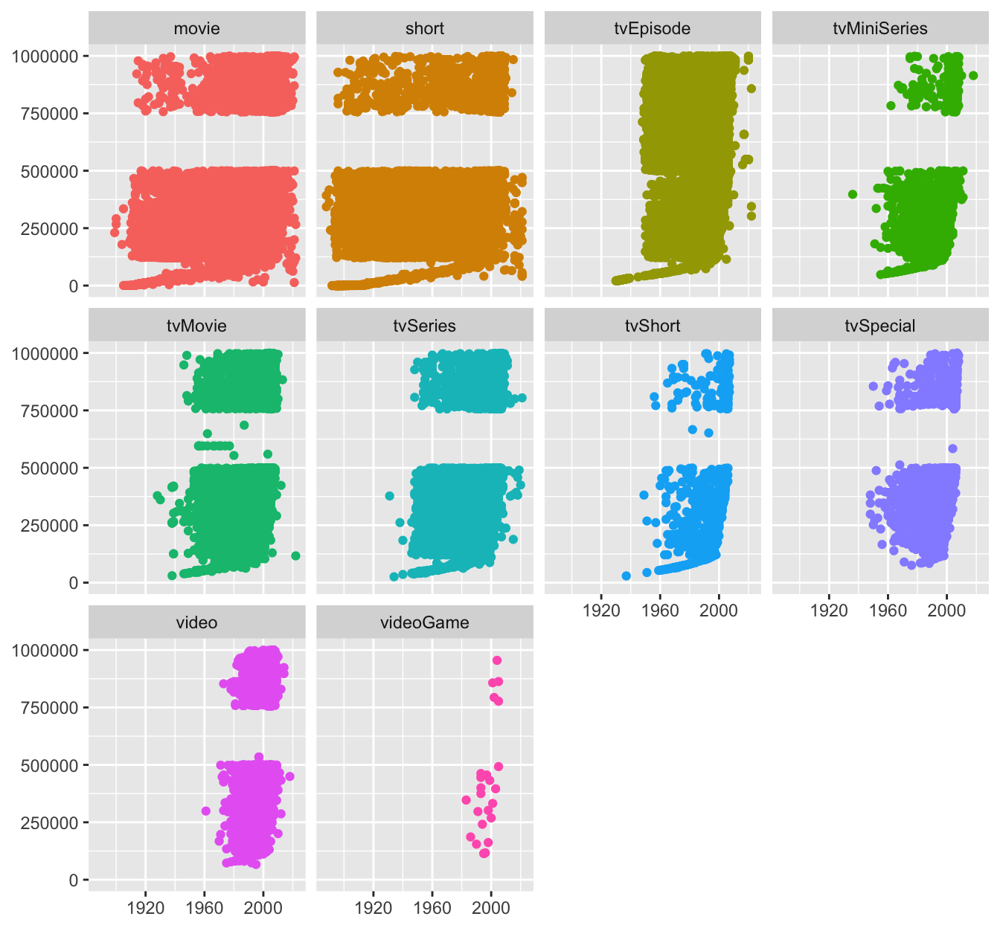

```{r setup25, include=FALSE}
source("_setupAll.R")
library(gt)
library(FilmsGmooG)
options(scipen=999)
```

# Looking at the movies {#secMovies}
\index{Films!The Maltese Falcon}

> "The stuff that dreams are made of" 

> `r quote_footer('---  Humphrey Bogart as Sam Spade, in \'The Maltese Falcon\'')`

**Background**  The Internet Movie Database (IMDb) collects information on a huge number of films and TV shows including ratings provided by users.

**Questions**  How long are film runtimes?  What ratings do films get?  How many users rate them?  How have the numbers of films of different genres developed?

**Sources**  IMDb website (@imdb:2022)

**Structure**   
Two datasets were merged.  One contained basic information on each film or show and the other supplied average user ratings and the numbers of ratings.\index{datasets!movies}

## Trailer {#secMovies1}
```{r}
data(films22)
films22 <- films22 %>% separate(genres, c("gen1", "gen2", "gen3"), sep=",", remove=FALSE)
films22 <- films22 %>% mutate(ng=ifelse(is.na(gen1), 0, 1) + ifelse(is.na(gen2), 0, 1) + ifelse(is.na(gen3), 0, 1))
films22 <- films22 %>% group_by(genres) %>% mutate(mm=n()) %>% ungroup()
```

Many people use IMDb ratings to help them decide what they would like to watch.  The ratings are contributed by users of the site.  This chapter studies the data on films for which ratings are available.  There is a dataset of 58,788 films scraped from IMDb\index{IMDb} several years ago that is available in the R package **ggplot2movies**\index{R packages!ggplot2movies}.  Nowadays IMDb makes regularly updated datasets available for download from their website.  The one used here was downloaded in July 2022.  There were 9,033,256 items and 1,251,317 had user ratings or votes.  Excluding items labelled TV or video and restricting the data to movies and shorts that had more than 100 ratings left 124,667 films.

\newpage

```{r movieRunB, fig.asp=0.2, fig.cap = 'Movie runtimes in weeks'}
ggplot(films22, aes("", runtime/10080)) + geom_boxplot() + coord_flip() + ylab(NULL) + xlab(NULL) + theme(axis.ticks.y=element_blank())
```

The film runtimes are shown in Figure \@ref(fig:movieRunB) in a boxplot---or rather a few outliers are visible.\index{boxplot}  The film lasting over 5 weeks (over 50,000 minutes), is called "Logistics"\index{Films!Logistics} and records in reverse the journey of a pedometer from its production in China to its sale in Sweden.  To look at runtimes in more detail, the  films longer than 3 hours were excluded.  Figure \@ref(fig:movieRunH) shows a histogram drawn with a binwidth of 1 minute, the level of resolution of the data.\index{histogram}

```{r movieRunH, fig.asp=0.5, fig.cap = 'Distribution of movie runtimes in minutes for films of 3 hours or under'}
films22s <- films22 %>% filter(runtime<181)
f22s <- ggplot(films22s, aes(runtime)) + geom_histogram(boundary=0, binwidth=1, closed="left", fill="gold3") + ylab(NULL) + xlab(NULL) + scale_x_continuous(breaks=seq(0,180,30))
f22s
```

Many films are recorded as having runtimes of 90 minutes and others runtimes of values of multiples of 10 or, to a lesser extent, 5, a form of data heaping\index{heaping}.  The most common runtime for short films is 7 minutes.  IMDb provides information on technical specifications of the various releases of films.  The famous Japanese film "The Seven Samurai"\index{Films!The Seven Samurai} is reported as having eight different runtimes ranging from 150 minutes to 207 minutes.  The highest value was the one supplied in the dataset.

## Movies in IMDb over the years {#secMovies2}
Figure \@ref(fig:movieRunY) looks at whether movie runtimes changed over time.  Alpha transparency\index{alpha transparency} has been used to reduce the effect of overplotting\index{overplotting} and to show where there is a lot of data.

```{r movieRunY, fig.asp=0.9, fig.cap = 'Movie runtimes in minutes by year of production for films of 3 hours or under using alpha=0.05'}
ggplot(films22s, aes(year, runtime)) + geom_point(colour="gold3", alpha=0.05) + ylab(NULL) + xlab(NULL) + scale_x_continuous(breaks=seq(1870, 2020, 10))
```

Early movies were short and later on there was a mixture of films and shorts.  The distribution of runtimes each year and the number of films each year are only hinted at in this scatterplot.  The following graphics use boxplots and a histogram to provide more informative views.

\newpage

Figure \@ref(fig:movieRunYB) displays boxplots\index{boxplot} by year with a histogram\index{histogram} of the number of movies in each year below.  The runtime distribution has been fairly constant for over 50 years.  The slight rise recently may reflect incomplete recording, as the lower plot shows fewer films produced in the latest three years included overall.  This is obvious for 2022, for which only the first six months could be covered.  The numbers for 2020 and 2021 suggest that it may take time for all films for a year to be added to the database. 

```{r movieRunYB, fig.asp=1.1, fig.cap = 'Movie runtimes in minutes (above), number of movies by year (below) for films of 3 hours or under'}
yb1 <- ggplot(films22s, aes(as.factor(year), runtime)) + geom_boxplot(fill="gold3", colour="gold3", outlier.size=1, outlier.colour="grey70", outlier.alpha=0.3) + ylab(NULL) + xlab(NULL) + scale_y_continuous(breaks=seq(0,180, 30), limits=c(0,180)) + scale_x_discrete(breaks=seq(1870, 2020, 10))
yb2 <- ggplot(films22s, aes(year)) + geom_histogram(fill="gold3", binwidth=1) + scale_x_continuous(breaks=seq(1870, 2020, 10)) + ylab(NULL) + xlab(NULL)
yb1/yb2
```

## What might IMDb code numbers mean? {#secMovies21}
Every film has been given a code by IMDb, so merging their datasets is straightforward.  As the codes are all of the form 'tt' followed by a number, those numbers were plotted against year to see if there were any patterns.  The resulting scatterplot is shown in Figure \@ref(fig:movieTT).\index{scatterplot}

```{r movieTT, fig.cap = 'IMDb code numbers by year for films and shorts with over 100 votes'}
ggplot(films22, aes(year, nr)) + geom_point(colour="gold3") + ylab(NULL) + xlab(NULL) 
```

It looks as though most numbers were allocated in order of production year, but that some films were added to the database later.  This is particularly true of the very early films.  People might have thought that the Lumière brothers' films\index{people!Lumière brothers} of 1895 were the first, but there are  recorded earlier, and it appears, judging by the numbering, these were initially not in the database.  The earliest film listed is "Passage de Venus" (Transit of Venus) from 1874, a few seconds recorded using a photographic revolver.  Several early films are by the extraordinary Eadweard Muybridge, the man who showed that all four hooves of a galloping horse are off the ground at the same time.

As Figure \@ref(fig:movieTT) only includes films and shorts that received at least 100 votes, it may be misleading.  The same plot was drawn for the over 1.25 million items with any ratings at all.  This suggested that there might be informative features for low code numbers.  Figure \@ref(fig:movieTT2) limits code numbers to less than 1,000,000 and facets\index{faceting} by type of item\index{scatterplot}.  The scatterplots imply that a set of code numbers between 500,000 and 750,000 was reserved for TV episodes.  The TV categories predominantly start in the 1950s and the video category in the 1960s.  Quite why the major categories appear to have a tail to the left is unclear.  All this may have little importance but is an example of what graphics may uncover that would be difficult to find in other ways.  There is an advantage in having something to talk about with domain experts, and it may lead to other, more pertinent, information emerging.

```{r movieTT2, fig.height=6.5, out.width="100%", fig.cap = 'IMDb code numbers by year for all items with ratings and  with code numbers less than 1,000,000'}

```

## What ratings do people give films? {#secMovies3}
Users can give films a rating from 1 to 10.  IMDb applies an unpublished algorithm to calculate a weighted average rating for every film.   The distribution of average ratings for films is shown in Figure \@ref(fig:movieRH)\index{histogram}.

```{r movieRH, fig.asp=0.425, fig.cap = 'Average user ratings for movies with over 100 ratings'}
ggplot(films22, aes(averageRating)) + geom_histogram(breaks=seq(1,10,0.2), fill="darkorange1") + ylab(NULL) + xlab(NULL)
```

These average user ratings are based on anything from 101 votes to over two and a half million.  Average ratings tend to be higher rather than lower.

The distribution of the number of ratings is skewed\index{skewness} to the right, meaning that most films do not get many ratings and a few get a large number of ratings.  After taking logs to see more, the distribution is still skew, albeit less so, as is shown in Figure \@ref(fig:movieLV)\index{histogram}\index{transformation!log}.

```{r movieLV, fig.asp=0.425, fig.cap = 'Numbers of votes for each movie on a log base 10 scale'}
ggplot(films22, aes(numVotes)) + geom_histogram(bins=50, fill="royalblue") + ylab(NULL) + xlab(NULL) + scale_x_log10()
```

Figure \@ref(fig:movieVR) shows how the average rating for films relates to the number of ratings submitted\index{scatterplot}.  This is a plot of films, so many of the points to the left represent a large number of films.  The points have been drawn relatively large and with no use of alpha transparency\index{alpha transparency} to ensure that high and outlying values can be seen.  As an example of the density of points with low numbers of ratings, there are films that were rated between 100 and 500 times and have an average rating of 6.3.  The plot has an unusual form, like a lower case r, with several features that are marked by boxes in Figure \@ref(fig:movieVR4)\index{scatterplot}.


```{r movieVR, fig.asp=0.8, fig.cap = 'Average user rating by number of votes'}
vr <- ggplot(films22, aes(numVotes/1000000, averageRating)) + geom_point(colour="darkorange1") + ylab(NULL) + xlab("Number of votes in millions") + xlim(-0.25, 3)
vr
```

```{r movieVR4, fig.asp=10/6, fig.cap = 'User ratings by number of votes with features marked by boxes'}
vr1 <- vr + annotate("rect", xmin=1, xmax=2.7, ymin=1, ymax=7.5, colour="green", alpha=0, size=1.5)
vr2 <- vr + annotate("rect", xmin=1, xmax=2.7, ymin=9.8, ymax=7.6, colour="darkblue", alpha=0, size=1.5)
vr3 <- vr + annotate("rect", xmin=-0.1, xmax=0.2, ymin=9.4, ymax=10.2, colour="darkmagenta", alpha=0, size=1.5)
vr4 <- vr + annotate("rect", xmin=0.22, xmax=0.35, ymin=3.4, ymax=4.4, colour="dodgerblue", alpha=0, size=1.5)
vr1/vr2/vr3/vr4
```

There are no films with a low rating and many votes (the first plot of Figure \@ref(fig:movieVR4)).  The relatively few films rated by over a million users all have a high average rating (second plot of Figure \@ref(fig:movieVR4)).  However, the highest average ratings are achieved by films with much fewer votes (third plot of Figure \@ref(fig:movieVR4))---possibly the support of family, friends, and colleagues?  A few films have low average ratings compared with other films receiving the same number of votes (fourth plot of Figure \@ref(fig:movieVR4)). "Batman & Robin" (over 250,000 votes and an average rating of 3.7) and "Fifty Shades of Grey" (over 300,000 and 4.1) are two examples.

## Genres from Rom-Com to Film Noir {#secMovies4}
Films may be described as being of a type or genre.  There is no uniform way of doing this and IMDb uses descriptions of up to three genres for each film.  When there is more than one genre listed for a film, they are listed alphabetically.  In this dataset of films with more than 100 ratings there are almost 1250 different descriptions, i.e., combinations of up to three genres.  The top 20 combinations of up to three genre descriptors with cumulative percentages were

```{r movieTab}
gX <- films22 %>% count(genres) %>% arrange(-n)
gX <- gX %>% mutate(id=seq(1,dim(gX)[1]), cn=cumsum(n), cp=100*cn/dim(films22)[1])
gX <- gX %>% mutate(cumPerc=round(cp,1))
gX %>% slice_head(n=20) %>% select(genres, cumPerc) %>% gt()
```

Figure \@ref(fig:moviePar) shows the corresponding cumulative distribution\index{cumulative distribution}.

```{r moviePar, out.width="70%", fig.width=6.5*0.7, fig.asp=0.5, fig.cap = 'Percentage of films by number of combinations of genres, almost 80\\% of films are covered by the first 100 combinations (dotted line)'}
ggplot(gX, aes(id, cp)) + geom_line() + ylab(NULL) + xlab(NULL) + scale_y_continuous(breaks=seq(0,100,20), limits=c(0,100)) + geom_vline(xintercept=100, linetype="dotted")
```

There were 22 individual genre descriptors that are each mentioned over 3000 times in the dataset.  This excludes films with no description, Adult films, Film Noir, and four other minor categories.  Film Noir\index{Film Noir} is a well-known term referring to cynical crime dramas filmed in black and white,  but has not been used by IMDb for any film made after 1958.  The last Film Noir listed is the famous Orson Welles film "Touch of Evil"\index{Films!Touch of Evil}.

Another version of the dataset has been constructed with up to 3 records per film, listing the genres separately in the same column.  This allows grouping by genre, but means that some films may appear in up to 3 groups.  Figure \@ref(fig:movieGT) plots time series of the percentages of films for which three particular genre descriptors were used.  In the silent era the descriptor Comedy was used a lot, but there were far fewer films and they were shorter.  Romance had a peak when sound came in.  Drama has been used the most for many years.  As on average around two descriptors were used for each film, the percentages for all would add up to about 200.

```{r movieGT, fig.asp=0.6, fig.cap = 'Percentages of films using the genre descriptors Drama, Comedy, Romance'}
films22 <- films22 %>% group_by(year) %>% mutate(nt=n())
gfilms22 <- films22 %>% separate_rows(genres, sep=",")
gfilms22 <- gfilms22 %>% group_by(genres) %>% mutate(ng=n())
gfilms22 <- gfilms22 %>% group_by(genres, year) %>% mutate(gn=n(), pg=100*gn/nt) %>% ungroup()
gfilms22 <- gfilms22 %>% mutate(Genres=fct_reorder(genres, gn, max, .desc=TRUE))
colFilms <- c("darkgreen", "blue", "pink", "lightblue", "darkolivegreen2", "red", "firebrick1", "black", "blue", "brown", "purple", "darkorange2", "chartreuse1", "hotpink", "deepskyblue", "coral", "indianred2", "cyan", "lightgreen", "deeppink2", "burlywood3", "cyan1")
names(colFilms) <- levels(gfilms22$Genres)[c(1:21, 24)]
hfilms22 <- gfilms22 %>% filter(year>1900, year<2020)
ggplot(hfilms22 %>% filter(Genres %in% c("Drama", "Comedy", "Romance")), aes(year, pg, group=Genres, colour=Genres)) + geom_line() + ylab(NULL) + xlab(NULL) + scale_colour_manual(values=colFilms) + theme(legend.title=element_blank())
```

Instead of calculating percentages on the total numbers of films, it could have been done on the total numbers of genre descriptors used.  As an alternative to percentages, the absolute numbers of films for which particular descriptors were used could be plotted, and this is done in Figure \@ref(fig:movieGF) for the 22 main genres by year from 1901 to 2019\index{time series}\index{faceting}\index{scaling}\index{guideline}.  The genres have been put into groups with roughly the same maximum number of films in a year.  Each group is plotted on a separate row with its own vertical scale, so that the top row has a range over ten times that of the bottom row.  Otherwise the Drama genre would determine the scale and the development over time of the other genres would hardly be visible.

Drama is the genre listed most often, whether alone or as one of two or one of three descriptors, and its number increased steadily until around the year 2000, when the increase became much more rapid.  The Comedy genre followed a related pattern, but with a slower increase since 2000.  Of the four genres in the second row, Action and Thriller rose earlier, and Horror even fell in the 1990s, while Documentary only took off after 2000.  All four are at about the same annual level in 2019.  In the third row, the peak in Romance films after sound films began stands out.  A related feature can be seen in the fourth row, where both the Family and Animation genres had peaks across the 1930s and 1940s.  The numbers for the genres in the fifth and final row are lower.  There were more musicals made shortly after sound was introduced than at any time afterwards.  War films peaked in World War II and Westerns had their last peak in the 1960s.

The increasing number of films in more recent years is probably due to the development of film industries in countries like India.  Lower numbers in earlier years may reflect the restriction to films having more than 100 ratings.  Comparing the old dataset referred to in §\@ref(secMovies1) with the new one, numbers of ratings have increased.  This is likely to have favoured newer films.  IMDb first moved to the web in 1993 and is relatively young compared to the film industry itself.  This doubtless also favours new films over old in terms of whether they are rated by someone.

There are a large number of genres and combinations of genres.  The accuracy or otherwise of the classifications of films may be debatable, but, if nothing else, these kinds of graphics offer much opportunity for entertaining discussion.  Experts in film may be able to offer explanations for some of the features on view.  As always, good graphics can stimulate more involvement with the data than tables or text alone.

```{r movieGF, fig.asp=1.3, fig.cap = 'Number of films by year from 1901 to 2019, faceted by genre in order of highest number per year, a dotted line marks the introduction of sound in 1927 and vertical scales are different for each row'}
g0 <- ggplot() + ylab(NULL) + xlab(NULL) + geom_vline(xintercept=1927, linetype="dotted") + scale_x_continuous(breaks=c(1900, 1960, 2020)) + theme(axis.text.x=element_blank()) + ylab(NULL) + xlab(NULL) + guides(colour="none") + scale_colour_manual(values=colFilms)
gL1 <- g0 + geom_line(data=hfilms22 %>% filter(Genres %in% c("Comedy", "Drama")), aes(year, gn, colour=Genres), linewidth=1.25) + facet_wrap(vars(Genres))
gL2 <- g0 + geom_line(data=hfilms22 %>% filter(Genres %in% c("Thriller", "Horror", "Documentary", "Action")), aes(year, gn, colour=Genres), linewidth=1.25) + facet_wrap(vars(Genres), nrow=1)
gL3 <- g0 + geom_line(data=hfilms22 %>% filter(Genres %in% c("Romance", "Crime", "Adventure", "Mystery")), aes(year, gn, colour=Genres), linewidth=1.25) + facet_wrap(vars(Genres), nrow=1)
gL4 <- g0 + geom_line(data=hfilms22 %>% filter(Genres %in% c("Short", "Biography", "Family", "Sci-Fi", "Fantasy", "Animation")), aes(year, gn, colour=Genres), linewidth=1.25) + facet_wrap(vars(Genres), nrow=1)
gL5 <- g0 + geom_line(data=hfilms22 %>% filter(Genres %in% c("History", "Music", "Sport", "War", "Western", "Musical")), aes(year, gn, colour=Genres), linewidth=1.25) + facet_wrap(vars(Genres), nrow=1)
layout <- "
AA####
BBBB##
CCCC##
DDDDDD
EEEEEE
"
gL1 + gL2 + gL3 + gL4 + gL5 + plot_layout(design = layout)
```

## Comparing Raging Bull with Jane Austen {#secMovies5}
Every IMDb webpage for a film includes a barchart\index{barchart} of individual ratings received by a film and average ratings and numbers of votes by sex and four age groups.  Around 30% of users do not report their own sex and age.  It is not known how reliable the information from the other 70% might be.

Two films were chosen that would have different user responses, "Raging Bull"\index{Films!Raging Bull}, the Robert De Niro boxing picture about Jake LaMotta, and "Sense and Sensibility"\index{Films!Sense and Sensibility}, the Emma Thompson version of Jane Austen's novel.  Figure \@ref(fig:RBjaB) shows barcharts of the rating distributions\index{barchart}.  The vertical scales are quite different\index{scaling}\index{faceting}, as there were around 115,000 ratings of "Sense and Sensibility" and just over three times as many of "Raging Bull".  The patterns are fairly similar, very few poor ratings and the most popular rating being 8 out of 10.

```{r RBjaB, fig.asp=0.4, fig.cap = 'User ratings of two films'}
data(RBSS)
RBa <- sum((RBSS %>% filter(Film %in% c("Raging Bull")))$Freq)
SSa <- sum((RBSS %>% filter(Film %in% c("Sense & Sensibility")))$Freq)
data(RBSSr)
RBs <- sum((RBSSr %>% filter(Film %in% c("Raging Bull")))$Freq)
SSs <- sum((RBSSr %>% filter(Film %in% c("Sense & Sensibility")))$Freq)
ggplot(RBSS, aes(factor(Rating), weight=Freq)) + geom_bar(aes(fill=Film)) + facet_wrap(vars(Film), scale="free_y") + guides(fill="none") + ylab(NULL) + xlab(NULL) + scale_fill_manual(values=c("orangered3", "powderblue"))
```

Only average ratings are available for the demographic groups, but the number of users in each group is given. Of the who rated Raging Bull,  reported their sex and the corresponding figure for Sense and Sensibility was.   Figure \@ref(fig:RBjaP) uses a bubble chart to show the results\index{bubble chart}.

```{r RBjaP, fig.asp=0.4, fig.cap = 'Average ratings of two films by user age and sex with point size proportional to number of ratings'}
ggplot(RBSSr %>% filter(!Age %in% c("<18")), aes(Age, AvRating, size=Freq)) + geom_point(aes(colour=Film)) + facet_grid(cols=vars(Film, Sex)) + ylab(NULL) + guides(size="none", colour="none") + scale_size_area(max_size=20) + scale_colour_manual(values=c("orangered3", "powderblue")) + xlab(NULL) + ylim(7, 8.5)
```

Few rating these films reported their age as under 18, so this age group has been left out.  A lot more men (around 230,000) than women (about 21,600) rated "Raging Bull" and the men rated the film more highly than the women on average.  More women (over 45,000) than men (about 38,800) rated "Sense and Sensibility".  This is unusual on IMDb, as usually more men rate a film.  The women rated "Sense and Sensibility" more highly than the men on average.

\newpage

**Answers**
There are a very few extraordinarily long films, but most are less than 3 hours.  Many have rounded runtimes, especially 90 minutes.  Runtimes have not changed much over the last 50 years.

Most films get an average rating of between 5 and 7.5 out of 10.  Apart from a few films that are relatively rarely rated, the top-rated films have an average of just over 9.  Some of the most highly rated films have been rated over 1,000,000 times.

The number of films produced in the last 20 years has increased sharply for most genres, at least for the films in the IMDb database.  War films, Westerns, and Musicals have not.

**Further questions**  
How do ratings and numbers of votes change over time?  How do ratings vary by age and sex?  Are films from different countries rated differently?     

### Graphical takeaways {-}
* Data heaping is visible in histograms when the binwidth is equal to the data resolution.\index{heaping}  (Figure \@ref(fig:movieRunH))
* Alpha transparency shows where the data are in scatterplots.\index{scatterplot}\index{alpha transparency}  (Figure \@ref(fig:movieRunY))
* Faceting\index{faceting} emphasises distinctive features of groups.  (Figures \@ref(fig:movieTT2) and \@ref(fig:movieGF))
* Scatterplots can display many different kinds of information.  (Figure \@ref(fig:movieVR))
