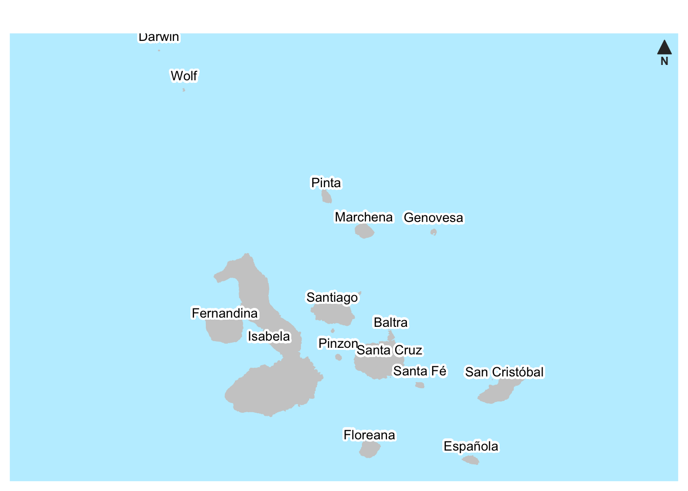

```{r setup045, include=FALSE}
source("_setupAll.R")
library(ggpcp)
```

# Darwin's Finches {#secFinches}

> "It is always advisable to perceive clearly our ignorance."

> `r quote_footer('--- Charles Darwin')`

**Background**  Darwin's finches are species that live on the Galápagos Islands.  They are an important example in the Theory of Evolution.

**Questions** How do the species differ?  Are there differences between the same species on different islands?  Are there differences between the sexes?

**Sources**  Dryad Digital Repository (@snodgrass:2008) for the data and https://biogeo.ucdavis.edu for the map.

**Structure**  549 birds and 20 variables\index{datasets!Darwin's finches}

## How do Darwin's finches differ? {#secFinches1}
Darwin\index{people!Darwin@Charles Darwin} visited the Galápagos Islands\index{Galápagos Islands} in 1835 as part of his voyage on HMS Beagle.  He collected many specimens, including birds he described as species of finches.  Later researchers decided they are passerine birds belonging to the tanager family.  Although Darwin collected finches, he only decided how important they might be a few years later.  There is much written on Darwin's finches and anyone with a deeper interest should read the book by Peter and Rosemary Grant (@grant:2014), describing their forty years of detailed investigations on one small island.  There is also an earlier populist book about the Grants' work (@weiner:1994).  

The Galápagos Islands are fairly isolated from the rest of the world and relatively similar to one another, so Darwin was surprised at the numbers of different species of finch he identified.  Classifying the species and investigating how they evolved is still part of ongoing research.  A crucial feature is the size and shape of the beaks of the birds.  Several datasets of measurements are available from the Dryad Digital Repository.  Some have more information, some less.  In this chapter morphological data from the Snodgrass and Heller Stanford expedition of 1898-99 to the Galápagos Islands are investigated (@snodgrass:1904, and @snodgrass:2008 for the data), as more features were measured and there were fewer missing values.  The dataset is in the R package **hypervolume** (@blonder:2019)\index{R packages!hypervolume} called *morphSnodgrassHeller*.

The first few plots display finches from the biggest island, Isabela, showing only species of the genus *Geospiza* with at least 10 birds (four species are excluded).  Only birds with complete sets of measurements are included (so sixteen are not).  Figure \@ref(fig:finchBar) shows the numbers of the five species in the subset.\index{barchart}  There are more specimens of *Fuliginosa parvula* than of the other four species combined.

```{r finchBar, fig.asp=0.7, out.width="70%", fig.width=6.5*0.7, fig.cap = 'Numbers of finch species from Isabela Island with at least ten birds and complete data'}
data(morphSnodgrassHeller, package="hypervolume")
mSH <- morphSnodgrassHeller %>% mutate(N.UBkL=as.numeric(as.character(N.UBkL)))
mSH1 <- mSH %>% filter(IslandID=="Isa_Alb")
mSH1 <- mSH1 %>% filter(!TaxonOrig=="Certhidea olivacea olivacea")
mSH1 <- mSH1 %>% group_by(TaxonOrig) %>% mutate(tot=n()) %>% filter(tot>9)
mSH1 <- mSH1 %>% select(-Plumage, -MToeL)
mSH1 <- na.omit(mSH1)
mSH1 <- mSH1 %>% mutate(species=str_replace(TaxonOrig, "Geospiza", ""))
colblind4 <- c(colorblind_pal()(8), "grey60")
colblind6 <- c(colblind4[2:4], "sienna4", "lawngreen", colblind4[6:8], colblind4[5])
colblind5 <- colblind6[4:8]
finch1X <- ggplot(mSH1, aes(species)) + geom_bar(aes(fill=species), alpha=0.5) + xlab(NULL) + ylab(NULL) + theme(legend.position="none", panel.background = element_blank()) + coord_flip()  + scale_x_discrete(limits=rev(levels(as.factor(mSH1$species)))) + scale_fill_manual(values=colblind5)
finch1X
```

One way of comparing species measurements is to use boxplots.  Figure \@ref(fig:finchBox) shows an example for body and wing lengths of the finches.\index{boxplot}  The patterns are consistent.  Two species are generally shorter than the others, two are in the middle, and one is bigger.  The low numbers in each of the groups and the overlaps make firm conclusions based on Figure \@ref(fig:finchBox) difficult.  Displaying the two variables together in a scatterplot might show if the variables separate the groups.  The two variables together appear to separate some of the species pairs, but there is clearly some overplotting\index{overplotting}, so caution is necessary\index{scatterplot}.  A check confirms that of the pairs of values are duplicates.

```{r finchBox, fig.asp=0.5, fig.cap = 'Body and wing lengths for the five species from Isabela Island'}
a0 <- ggplot(mSH1) + xlab(NULL) + theme_classic() + theme(legend.position="none") + scale_fill_manual(values=colblind5) + coord_flip()
a1 <- a0  + geom_boxplot(aes(species, BodyL, fill=species), alpha=0.5) + ylab("Body length (mm)")
a2 <- a0  + geom_boxplot(aes(species, WingL, fill=species), alpha=0.5) + ylab("Wing length (mm)") + theme(axis.ticks.y = element_blank(), axis.text.y = element_blank())
finch2X <- a1+a2
finch2X
```

```{r finchScat, fig.asp=0.8, out.width="80%", fig.width=6.5*0.8, fig.cap = 'Scatterplot of wing length and body length for the five species from Isabela Island'}
finch3X <- ggplot(mSH1, aes(BodyL, WingL)) + geom_point(aes(colour=species), size=2, alpha=0.5) + theme(legend.position = "bottom", legend.title=element_blank(), panel.background = element_blank()) + xlab("Body length") + ylab("Wing length") + scale_colour_manual(values=colblind5) + guides(color = guide_legend(nrow = 2))
finch3X
```

\clearpage

Other variables could be more discriminatory.  The parallel coordinate plot\index{parallel coordinate plot} in Figure \@ref(fig:finchPCP) uses all nine measurements available. 

```{r finchPCP, fig.asp=0.7, fig.cap = 'Parallel coordinate plot of nine measurements of five Galápagos finch species from Isabela Island'}
finchpcpX <- mSH1 %>% pcp_select(BodyL:TarsusL) %>% pcp_scale(method="std") %>% ggplot(aes_pcp()) + geom_pcp_axes(colour="white") + geom_pcp(aes(colour=species), alpha=0.5) + ylab(NULL) + xlab(NULL) + theme_tufte() + theme(legend.position="bottom", legend.title=element_blank(), axis.text.y=element_blank(), axis.ticks.y=element_blank()) + scale_colour_manual(values=colblind5)
finchpcpX
```

The first two beak measurements of width and height (BeakW and BeakH) separate the two bigger species from the other three.  The following three variables (`LBeakL`, `UBeakL`, and `N.UBkL`, also beak measurements, the last being the distance from nose to upper beak) separate the smaller species from one another.  The two bigger species might be separated using a multivariate technique, but these two species are considered to be related subspecies, so demonstrable differences are unlikely.  Having all the beak measurements together in their order in the dataset turns out to be informative. Alphabetic order or a random order\index{ordering} of the nine variables would not be so effective.

What about the other four species on Isabela?  Drawing separate parallel coordinate plots for all nine species and including all 195 birds in Figure \@ref(fig:snodPCP) reveals that three of the extra species are distinct in some way from the other eight.  In each plot the rest of the dataset is drawn in a transparent black in the background, ghostplotting\index{ghostplotting}.  The species *crassirostris* has longer body and tarsus lengths than the other species, *Olivacea olivacea* has the shortest wings, *Scandens rothschildi* has the longest upper and lower beak measurements.\index{parallel coordinate plot}\index{faceting}

```{r snodPCP, fig.asp=1.2, fig.cap = 'Parallel coordinate plot of nine measurements of nine Galápagos finch species from Isabela Island'}
snodH <- mSH %>% mutate(Species=str_replace_all(TaxonOrig, " ", "_"), Species=gsub("_$", "",  Species))
names(snodH)[18] <- "N.UBkL"
snodH <- snodH %>% mutate(Island=case_when(
  IslandID=="Balt_SS" ~ "Baltra",
  IslandID=="Drwn_Clp" ~ "Darwin",
  IslandID=="Esp_Hd" ~ "Espanola",
  IslandID=="Flor_Chrl" ~ "Floreana",
  IslandID=="Frn_Nrb" ~ "Fernandina",
  IslandID=="Gnov_Twr" ~ "Genovesa",
  IslandID=="Isa_Alb" ~ "Isabela",
  IslandID=="Mrch_Bndl" ~ "Marchena",
  IslandID=="Pnt_Abng" ~ "Pinta",
  IslandID=="Pnz_Dnc" ~ "Pinzon",
  IslandID=="SCris_Chat" ~ "San_Cristobal",
  IslandID=="SCru_Inde" ~ "Santa_Cruz",
  IslandID=="SFe_Brngt" ~ "Santa_Fe",
  IslandID=="Snti_Jams" ~ "Santiago",
  IslandID=="Wlf_Wnm" ~ "Wolf"
))
snod <- snodH %>% mutate(N.UBkL=str_replace(N.UBkL, "8..3", "8.3"), N.UBkL=as.numeric(N.UBkL))
snod <- snod %>% mutate(species=str_replace(Species, "Geospiza_", ""), species=str_replace(species, "Certhidia_", ""))
sxpcp <- snod %>% filter(Island=="Isabela") %>% pcp_select(BodyL:TarsusL) %>% pcp_scale(method="std") %>% ggplot(aes_pcp()) + geom_pcp(alpha = 0.05, colour = "black", data = . %>% select(-species)) + geom_pcp_axes(colour="white") + geom_pcp(aes(colour=species), linewidth=0.5, alpha=0.5) + ylab(NULL) + xlab(NULL) + facet_wrap(vars(species)) + theme_tufte() + theme(legend.position="none", axis.text.y=element_blank(), axis.ticks.y=element_blank(), axis.text.x = element_text(angle = -45)) + scale_colour_manual(values=colblind6)
sxpcp
```

## Do species vary across the Galápagos islands? {#secFinches2}
Isabela is the biggest of the Galápagos islands and the equator crosses it to the North.  Figure \@ref(fig:galapMap) gives a map of the islands, which lie about 900 km west of Ecuador.  The distance between Española to the South and Darwin to the North is 220 km.\index{Galápagos Islands}

```{r galapMap, out.width="100%", fig.cap = 'Map of the Galápagos Islands'}

```

The Daphne islands, where the Grants did a lot of their work (@grant:2014), are a little to the North of Santa Cruz and too small to appear here.  Daphne Major, the bigger of the two, is less than half a square kilometre in size.

Several species live on more than one island.  Snodgrass and Heller's dataset covering 15 islands ranges from Isabela with 195 birds from 9 species to Santa Cruz with 9 birds from 2 species.  Looking at the data the other way round, they reported 32 species in all, ranging from the 15 they found each only on 1 island to *Fulginosa parvula* which they found on 9 islands.  These data refer to the numbers of birds they collected and measured; there must have been many more.

\newpage

The species *Fuliginosa parvula* may be used for comparing one species living on different islands.  Figure \@ref(fig:Fulig) displays parallel coordinate plots with ghostplotting for *Fuliginosa parvula* on four islands where at least 9 birds were recorded.  The full dataset for all four islands is drawn in the background in each plot.\index{parallel coordinate plot}\index{faceting}\index{ghostplotting}

```{r Fulig, fig.asp=0.8, fig.cap = '\\textit{fuliginosa parvula} finches on four islands'}
snodFP <- snod %>% filter(species %in% c("fuliginosa_parvula")) %>% group_by(Island) %>% mutate(nn=n()) %>% filter(nn>8)
snodFP %>% pcp_select(BodyL:TarsusL) %>% pcp_scale(method="std") %>% ggplot(aes_pcp()) +
  geom_pcp(alpha = 0.05, colour = "black", data = . %>% select(-Island)) + geom_pcp_axes(colour="white") + geom_pcp(colour=colblind6[6]) + ylab(NULL) + xlab(NULL) + facet_wrap(vars(Island)) + theme_tufte() +  theme(legend.position="none", axis.ticks.y=element_blank(), axis.text.y=element_blank(), axis.text.x=element_text(angle=-45)) + scale_x_discrete(expand = expansion(add=0.75))
```

On average there do not appear to be distinct differences between *Fuliginosa parvula* finches on the four islands.  Some birds have unusual measurements, such as the two with long lower beaks on Fernandina and the one with a particularly short tarsus on Baltra.

\newpage

It is frequently the case that the males of a species are generally bigger than the females.  This is to some extent true here, for instance for the wing length measurements compared in Figure \@ref(fig:WingL).  Four species for which there were data for at least ten examples of each sex are shown.\index{boxplot}\index{jittering}

```{r WingL, fig.cap = 'Boxplots of wing lengths by sex for 4 different species with jittered dotplots drawn on top.  Species colours are the same as used earlier.  There are not enough specimens of \\textit{Fortis-platyrhyncha} for the species to be included.'}
SpecSex <- snod %>% group_by(species, Sex) %>% summarise(nn=n())
SpecSexW <- SpecSex %>% pivot_wider(values_from="nn", names_from="Sex", values_fill=0)
SpecSexW4 <- SpecSexW %>% filter(F > 9)
snodS <- snod %>% filter(species %in% SpecSexW4$species) %>% select(Sex, species, BodyL:TarsusL)
snodSlong <- snodS %>% pivot_longer(BodyL:TarsusL, names_to="Vars", values_to="Lengths")
ggplot(snodSlong %>% filter(Vars=="WingL"), aes(Sex, Lengths)) + geom_boxplot(aes(fill=species), colour="grey50", alpha=0.5, outlier.size=0) + geom_jitter(colour="grey60", width=0.05) + ylab(NULL) + facet_wrap(vars(species), nrow=1) + scale_fill_manual(values=colblind5[c(1,3,4,5)]) + theme(legend.position="none", panel.background = element_blank())
```

Two species, *Fortis fortis* and *Heliobates*, have longer wing lengths than the other two species.  It is curious that for the species with most birds, *Fulginosa parvula* with 62 females and 99 males, the birds with the two longest wing lengths are both females.

Twice as many males as females were measured by Snodgrass and Heller.  The research by the Grants (@weiner:1994) revealed that weather variation over the years can have dramatic effects on the sex ratio of the finches, with droughts leading to more females dying, particularly the smaller ones.  Perhaps 1898-99 was shortly after such a period.

\newpage

**Answers**  The nine species on Isabela can almost all be distinguished from one other with the measurements provided.  Species do not appear to differ between islands.  Males are generally bigger than females of the same species.

**Further questions**  Are the different bird measurements correlated with each other?  How do the data on the finches of the Galápagos Islands collected by other researchers compare with the data studied here?

### Graphical takeaways {-}
* Colour consistency across displays helps readers.\index{colour}  (Figures \@ref(fig:finchBar) to \@ref(fig:snodPCP) and \@ref(fig:WingL))
* The orderings of variables and categories in parallel coordinate plots make a big difference to what can be seen.\index{ordering}  (Figure \@ref(fig:snodPCP))
* Faceted parallel coordinate plots\index{parallel coordinate plot}\index{faceting} distinguish species better when the complete dataset is plotted in the background (ghostplotting).\index{ghostplotting}  (Figures \@ref(fig:snodPCP) and \@ref(fig:Fulig))

