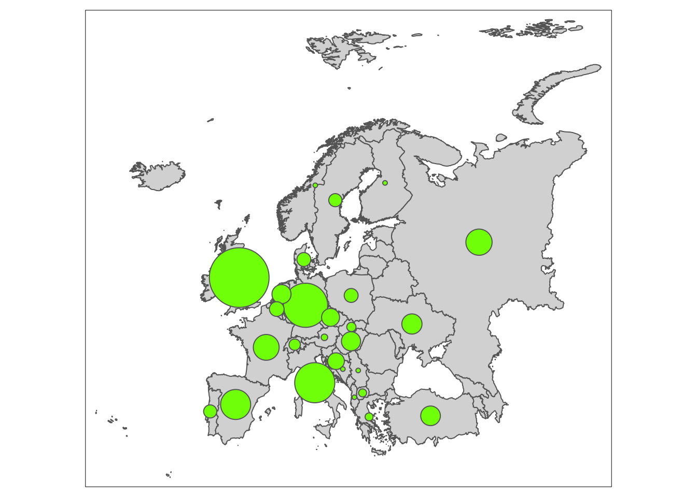

```{r setup046, include=FALSE}
source("_setupAll.R")
```

# Home or away: where do soccer players play? {#secEuros}

> "Milan or Madrid, as long as it's Italy."

> `r quote_footer('--- Andy Möller, then of Dortmund')`

**Background**  The European Football Championship takes place every four years.  It has gradually gained in importance since the first competition took place in 1960 when the finals involved only four teams.

**Questions**  Do European international football players play their league football in their own country?  How has this changed over the years?

**Sources**  @abel:2021

**Structure**  There are 4012 players included with 21 variables.\index{datasets!Euros teams}

## The European Football Championship since 1960 {#secEuros1}
The UEFA European Championship has grown considerably over the years.  There were 17 entries for the first competition in 1960 with 4 qualifying to compete in the finals.  The size of the finals was expanded to 8 teams in 1980, to 16 in 1996 and to 24 in 2016.  In 2020 there were 55 entries in the qualifying stages competing for 24 places in the finals.  Wikipedia says that there are 51 independent European states.  However, there were four separate teams from the United Kingdom (England, Scotland, Wales, Northern Ireland) and one from the British Overseas Territory of Gibraltar.  The Faroe Islands, an autonomous territory of Denmark entered, as did Israel, although it is neither fully European nor transcontinental (such as Russia and Turkey).  The only European states not to take part, other than the UK, were Monaco and Vatican City.

The squad sizes increased over time too, beginning with 17 and rising to 26.  Bigger tournaments need more players.  

\newpage

```{r uefaTQ, fig.asp=1.3, out.width="80%", fig.width=6.5*0.8, fig.cap = 'Numbers of teams (above) and squad sizes (below) over the 16 European Championships.  A point\'s area in the lower plot is proportional to the number of countries with that value (and the vertical scale starts at 15).'}
data(eu20p)
data(eu20col)
eu20col <- eu20col %>% mutate(coln=case_when(
  team_alpha3=="GB-ENG" ~ "#add8e6",
  team_alpha3=="DEU" ~ "#000000",
  team_alpha3=="RUS" ~ "#FF0000",
  .default = kit_shirt
))
ColsN <- deframe(eu20col %>% select(team_alpha3, coln))
colScaleN <- scale_fill_manual(name = "team_alpha3", values = ColsN)
eu20pQ <- eu20p %>% group_by(year, nat_team) %>% summarise(nn=n())
eu20pT <- eu20pQ %>% summarise(m=n())
q1 <- ggplot(eu20pT, aes(year, weight=m)) + geom_bar(fill="darkslategray2") + xlab(NULL) + ylab(NULL) + ylim(0,30) + ggtitle("Number of teams") + theme(plot.title=element_text(hjust=0.5, vjust=2))
q2 <- ggplot(eu20pQ, aes(year, nn)) + geom_count( colour="tan3") + xlab(NULL) + ylab(NULL) + theme(legend.position="none") + ylim(15, 30) + xlim(1958, 2022) + scale_size_area() + ggtitle("Squad sizes") + theme(plot.title=element_text(hjust=0.5, vjust=2))
q1/q2
```

There may have been no regulations concerning squad sizes in the early competitions and that would explain the variation in 1964 and 1976.  Since then, there must have been a fixed limit that all teams followed with two exceptions.  In 1996 Germany had several injured players and were allowed to call up an extra player, Jens Todt, before the final, although he did not actually play.  In the 2020 competition the Spanish manager called up only 24 of the 26 players permitted, not wanting to work with a large squad, when several would not be needed in the tournament.

At the first competition in 1960 just 4 teams took part and they only used players from their own national leagues.  As the competition expanded, the squads got bigger and more teams from smaller countries took part.  Their best players often played for richer clubs in bigger countries.  The steady downward progression in the average percentage of players coming from a nation's own league can be seen in Figure \@ref(fig:uefaPerc).\index{smooth}\index{bubble chart}

```{r uefaPerc, fig.asp=0.6, out.width="80%", fig.width=6.5*0.8, fig.cap = 'Percentage of a nation\'s players who played in their own country\'s league for each of the 16 European Championships.  Circle area is proportional to the number of countries with that percentage.  A loess smooth has been added.'}
eu20p <- eu20p %>% mutate(nat_team_alpha3=ifelse(nat_team_alpha3 %in% c("CIS", "SUN"), "RUS", nat_team_alpha3), club_alpha3=ifelse(club_alpha3 %in% c("CIS", "SUN"), "RUS", club_alpha3))
eu20p <- eu20p %>% mutate(nat_alpha=factor(nat_team_alpha3), club_alpha=factor(club_alpha3))
ls <- lvls_union(list(eu20p$nat_alpha, eu20p$club_alpha))
eu20p <- eu20p %>% mutate(nat_alpha=factor(nat_alpha, levels=ls), club_alpha=factor(club_alpha, levels=ls))
eu20T <- eu20p %>% group_by(year, nat_alpha) %>% mutate(m=n())
eu20T2 <- eu20T %>% group_by(year, nat_alpha, m, club_alpha) %>% summarise(nn=n(), perc=100*nn/m)
eu20T2a <- eu20T2 %>% summarise(mperc=mean(perc))
eu20T2b <- eu20T2a %>% mutate(Mperc=ifelse(nat_alpha==club_alpha, mperc, 0))
eu20T2c <- eu20T2b %>% group_by(year, nat_alpha) %>% summarise(mx=max(Mperc, na.rm=TRUE))
ggplot(eu20T2c, aes(year, round(mx))) + geom_count(colour="tan3") + geom_smooth(se=FALSE) + ylab(NULL) + xlab(NULL) + theme(legend.position="none") + scale_size_area()
```

The first team to have players from another league was Spain in 1964, who included two players based in Italy.  The first team with no players from their own country's league was the Republic of Ireland in 1988.  This was partly because their best players played elsewhere, but also because of "the grandparent rule", whereby players could play for the country of any of their parents or grandparents.  The Ireland manager at the time, Jack Charlton--who was English, used this a lot.   He sought players out with Irish ancestry who would not be selected for the country of their own nationality and encouraged them to experience international football by playing for Ireland.  In 2016 there was only one team with all players playing in its own country (England), and four teams with no players playing in their own country.

\newpage

## Which leagues do international players play in? {#secEuros2}

Four of the biggest European leagues are those of England, Germany, Italy, and Spain.  Figure \@ref(fig:uefaMap) shows how many players there were from those leagues in the EUROs from 1992 on.\index{time series}  Until 2008 the numbers were fairly equal.  Since then the English league has become much more important and numbers from Spain have remained static.

```{r uefaNos, fig.asp=0.5, out.width="80%", fig.width=6.5*0.8, fig.cap = 'Numbers of players from four major leagues'}
eu20pC <- eu20p %>% group_by(year, club_country) %>% summarise(nn=n())
ggplot(eu20pC %>% filter(year > 1990, club_country %in% c("England", "Italy", "Spain", "Germany")), aes(year, nn, group=club_country, colour=club_country)) + geom_line() + scale_colour_manual(values=c("#add8e6", "#000000", "#103CD6", "#E00000")) + xlab(NULL) + ylab(NULL) + theme(legend.title=element_blank())
```

The 2020 competition was delayed until 2021 because of the Covid pandemic.  @abel:2021 constructed a website of all the players who ever took part and drew chord diagrams\index{chord diagram} to show the relationships between the nationalities of the players and the countries they played in at club level.  Here barcharts are drawn to display the data for Euro 2020.\index{barchart}

```{r uefa20L, out.width="60%", fig.width=6.5*0.6, fig.cap = 'Numbers of Euro 2020 players playing in the different European leagues'}
eu20pX <- eu20p %>% filter(year=="2020") %>% mutate(clubCountry=fct_infreq(club_country_harm))
eu20pX <- eu20pX %>% mutate(nat_team4=factor(nat_team, levels=c(levels(clubCountry), "Wales")))
eu20pX <- eu20pX %>% mutate(clubC=fct_lump_min(clubCountry, 9), clubC=fct_relevel(clubC, "Other", after=Inf))
eu20pX <- eu20pX %>% group_by(nat_team) %>% mutate(hg=sum(clubC==nat_team), np=n(), phg=hg/np) %>% ungroup()
eu20pX <- eu20pX %>% mutate(nat_team0=factor(nat_team), nat_team0=fct_reorder(nat_team0, phg, mean, .desc=TRUE))
ggplot(eu20pX, aes(fct_rev(clubC))) + geom_bar(aes(fill=club_alpha3)) + ylab(NULL) + xlab(NULL) + theme(legend.position="none") + colScaleN + coord_flip()
```

Bars have mostly been coloured by the main shirt colour of that country.  Several teams use white, so England has been given light blue, Germany black, and Russia red.  Countries whose leagues provided less than 5 players have been grouped together into a final 'Other' category, including five nations who took part in the competition.  Of the players, just under a quarter, played in England.

A few players played in leagues outside of Europe.  For those playing in Europe, Figure \@ref(fig:uefaMap) shows the numbers playing in the different national leagues, including Turkey and Russia in Europe, and combining the numbers for the English and Scottish leagues.

```{r uefaMap, fig.asp=1, out.width="80%", fig.cap = 'Numbers of Euro 2020 players playing in various European national leagues'}

```

\clearpage

To show which players play where, barcharts are drawn, one for the national team of each participating country.  Figure \@ref(fig:uefa20f) shows the chart for Finland.  The individual bars show where Finland's players play their club football.   The bars have been ordered\index{ordering} by the total number of players from that league playing in Euro 2020.  Countries with less than 9 players in the competition have been grouped into "Other".  The first bar represents the number of Finnish players currently playing in England.\index{multiple barchart}\index{ordering}

```{r uefa20f, fig.asp=0.7, fig.width=4, fig.cap = 'Numbers of Finland\'s Euro 2020 players playing in various countries\' leagues'}
ggplot(eu20pX %>% filter(nat_team0=="Finland"), aes(fct_rev(clubC))) + geom_bar(aes(fill=club_alpha3)) + ylab(NULL) + xlab(NULL) + theme(legend.position="none", axis.text.x=element_blank(), axis.ticks.x=element_blank(), panel.grid = element_blank()) + colScaleN + coord_flip() + scale_x_discrete(expand = expansion(add = 1), drop=FALSE)
```

```{r uefa20, fig.height=8, fig.cap = 'Numbers of Euro 2020 players of each team playing in various countries\' leagues'}
uefa20w <- ggplot(eu20pX, aes(fct_rev(clubC))) + geom_bar(aes(fill=club_alpha3)) + ylab(NULL) + xlab(NULL) + theme(legend.position="none", axis.text.x=element_blank(), axis.ticks.x=element_blank(), panel.grid = element_blank()) + facet_wrap(vars(nat_team0), nrow=4) + colScaleN + coord_flip() + scale_x_discrete(expand = expansion(add = 1))
uefa20w
```

Figure \@ref(fig:uefa20) has 24 barcharts, one for each competing team.  The team charts have been ordered by the percentage of players playing in their own national league, so the chart for England comes first, as most of the English squad were playing in England.  Every country's team includes players from at least three different countries.  For some of the big teams (England, Italy, Russia), almost all the players come from their own league.  Germany's team includes several players playing in England and a few elsewhere.  Spain has as many players playing in England as in Spain.  France has about the same number of players playing in England, Germany, Spain, and France itself.  Most of the other countries have players playing in many leagues, the exceptions being Ukraine, where most play there, Austria whose team play mostly in Germany, Wales whose players play in the English league (even though a few of the teams are based in Wales), and Scotland whose players almost all play in England or Scotland.  Finland boasted the most distributed players.  Their squad of 26 played in 16 different national leagues.  Curiously, the country that had no team at the Euros but the most club players taking part was Cyprus with 8 (3 playing for North Macedonia, 2 for Finland, 2 for Slovakia, and 1 for Hungary).  Only Russia of the 24 competing countries had no players playing in England.

## How have countries changed? {#secEuros3}
Over sixty years much has changed in Europe.  Countries have split up (like the Soviet Union and Yugoslavia) or combined (like the two Germanies).  Other complications are that the four countries in the United Kingdom each have their own national team and all have reached the Euro finals at one time or another.

The dataset has four country variables: the squad name, the name of the national team (these two only differ for the Soviet Union/USSR); the name of the country of the player's club, and an amended version (differing for the Soviet Union/USSR, Yugoslavia, and for clubs based in Wales that play in the English leagues).  Three players had no club contract while playing in one of the competitions and their club details were recorded as missing.

Making the strong assumptions that the Soviet Union in the early competitions is the same as Russia in the later competitions and that Germany is the same country as West Germany before unification, the percentages of home players in the teams have been plotted for the countries that qualified for at least 8 of the Euro finals in Figure \@ref(fig:uefaPercM).\index{dotplot}\index{faceting}

```{r uefaPercM, fig.cap = 'Percentages of home players for the countries who played most often in the 16 European Championship finals'}
eu20T2c <- eu20T2c %>% group_by(nat_alpha) %>% mutate(nn=n())
colScaleC <- scale_colour_manual(name = "team_alpha3", values = ColsN)
eu20T2d <- droplevels(eu20T2c %>% filter(nn>7))
eu20T2d <- eu20T2d %>% mutate(nat_team=nat_alpha)
levels(eu20T2d$nat_team) <- c("Germany", "Denmark", "Spain", "France", "England", "Italy", "Netherlands", "Portugal", "Russia")
ggplot(eu20T2d, aes(year, round(mx), group=nat_alpha, colour=nat_alpha)) + geom_point() + xlab(NULL) + theme(legend.position="none") + facet_wrap(vars(nat_team)) + ylim(0,100) + ylab(NULL) + colScaleC
```

There is an interesting variety of patterns.  The rate for Germany, who have played most often despite not entering the first two competitions, shows a slight decline over time.  The exception was 1992 when 8 of their 20 players were playing in Italy.  The finals in 1992 were also different for Russia, when 12 of their players were playing abroad, a big change from the Soviet Union days.  Since 2004 they are back to a high percentage of home players, like Italy and England.  Both the French and Dutch rates dropped a lot in 2000.  In that competition Spain only used home players, but their rate has declined to less than 50% in the most recent competition.

There was no information included on results.  One possibility to make Figure \@ref(fig:uefaPerc) more comparable across the years would be to restrict it to the four semi-finalists in each competition.  The information was added to the dataset and the graphic drawn, but the main conclusion did not change.

\newpage

**Answers**  More and more international players play their football abroad.  Just over half of the players of the 24 teams at Euro 2020 played in England, Germany, or Italy.

**Further questions**  Which team had the biggest variability of home player percentage across the years?  Are their similar patterns for teams competing in the World Cup?  Is there data available on the composition of club teams by nationality?

### Graphical takeaways {-}
* Alignment of identical axes supports viewing ensembles of graphics.\index{alignment}\index{ensemble of graphics}  (Figure \@ref(fig:uefaTQ))
* Smooths are effective for discrete datasets too.\index{smooth}  (Figure \@ref(fig:uefaPerc))
* Faceting works for plots with many groups.\index{faceting}  (Figure \@ref(fig:uefa20))
