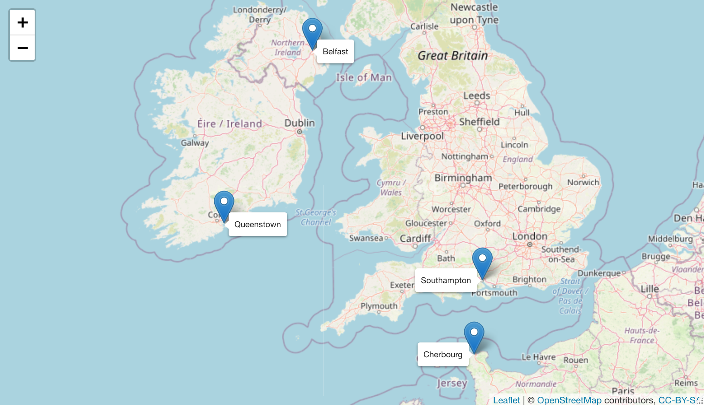

```{r setup58, include=FALSE}
source("_setupAll.R")
```

# The Titanic Disaster {#secTitan}

> "I cannot imagine any condition which would cause a ship to founder. I cannot conceive of any vital disaster happening to this vessel. Modern shipbuilding has gone beyond that."

> `r quote_footer('Captain Smith of the *Titanic*, talking of the *Adriatic* (1907)')`

**Background**  The RMS Titanic sank in the North Atlantic on its maiden voyage in April 1912 with great loss of life, mainly because there were not enough lifeboats.

**Questions**  Who travelled on the Titanic?  Did women and children have better chances of surviving?  What about the crew?  Why did so many die?

**Sources**  Encyclopedia Titanica (@titanic:2021)

**Structure**  2208 cases with 16 variables\index{datasets!Titanic}

## Who travelled on the Titanic? {#secTitan1}
The tragic event of the sinking of the Titanic has been remembered in innumerable books, films, and articles, and there has always been interest in who survived and who did not.

There are many datasets in circulation offering summary information on the Titanic, around fifteen or so in \textsf{R} and its packages.  Some have more data, some less, some use different variable names---it can be confusing.  Continuing effort by Titanic researchers has unearthed more detail and there are now lists of those on board available at Encyclopedia Titanica (@titanic:2021) giving full names and ages, as well as sex and passenger class or crew department.  Information on fares is also given, but is incomplete.  The dataset used here only includes passengers and crew who sailed for America.

\newpage

Before looking at survival rates, it is interesting to look at who actually travelled.  The ship started in Belfast, in the North of Ireland, where it had been built, sailed to Southampton, crossed the Channel to Cherbourg in France, stopped off at Queenstown (now Cobh), Cork's harbour in the South of Ireland, and then set off across the Atlantic.\index{map}

```{r titanPorts, out.width="90%", fig.align = 'center', fig.cap = "Belfast to Southampton to Cherbourg to Queenstown  Map:© OpenStreetMap contributors"}

```

```{r titanBoard, fig.asp=0.8, out.width="70%", fig.width=6.5*0.7, fig.cap = 'Numbers boarding the Titanic by port'}
data(TitanicPassCrew)
BSCQ <- ggplot(TitanicPassCrew, aes(Joined)) + geom_bar(fill="lightcoral") + ylab(NULL) + xlab(NULL)
BSCQ
```

The majority of passengers and crew joined the ship in Southampton and probably the people starting in Belfast were crew.  Figure \@ref(fig:titanBG) shows where males and females boarded.\index{barchart}  No females joined the Titanic in Belfast and the numbers of males and females who joined in Cherbourg and Queenstown look about equal.

```{r titanBG, fig.asp=0.5, fig.cap = 'Numbers boarding the Titanic at each port by sex'}
TitanMVy <- TitanicPassCrew %>% mutate(sex=factor(Gender, levels=c("Male", "Female")))
ggplot(TitanMVy, aes(Joined)) + geom_bar(aes(fill=sex)) + ylab(NULL) + xlab("Boarded") + facet_wrap(vars(sex)) + scale_fill_manual(values=c("springgreen3", "purple2")) + guides(fill="none")
```

Figure \@ref(fig:titanBC) shows the boarding patterns for passengers and crew by sex.  The bulk of the crew joined in Southampton as did many more male passengers than female passengers, unlike at Cherbourg and Queenstown.  There were even a very few passengers who boarded in Belfast, but, with one exception, these were employees of Harland & Wolff, the ship's builders.
  
```{r titanBC, fig.asp=0.5, fig.cap = 'Numbers boarding the Titanic by sex and by passenger or crew'}
TitanMVy <- TitanMVy %>% mutate(class=fct_collapse(Area, Crew=c("Deck", "Engineering", "Victualling", "Restaurant")))
TitanMVy <- TitanMVy %>% mutate(passCrew=ifelse(Area %in% c("Deck", "Engineering", "Victualling", "Restaurant"), "Crew", "Passenger"))
ggplot(TitanMVy, aes(Joined)) + geom_bar(aes(fill=sex)) + ylab(NULL) + xlab("Boarded") + facet_grid(cols=vars(sex), rows=vars(passCrew)) + scale_fill_manual(values=c("springgreen3", "purple2")) + guides(fill="none")
```

Figure \@ref(fig:titanBcla) looks at differences in boarding patterns for passengers by sex and class.  Almost all those who boarded in Ireland travelled third class.  Of the first class passengers who boarded in France there were more females than males.

```{r titanBcla, fig.asp=0.6, fig.cap = 'Numbers of passengers boarding the Titanic by sex and class'}
ggplot(TitanMVy %>% filter(passCrew=="Passenger"), aes(Joined)) + geom_bar(aes(fill=sex)) + ylab(NULL) + xlab("Boarded") + facet_grid(cols=vars(sex), rows=vars(Group)) + scale_fill_manual(values=c("springgreen3", "purple2")) + guides(fill="none")
```

There is information on passenger nationality and this is shown by port of boarding in Figure \@ref(fig:titanBn).  Any nationality with 25 or fewer passengers has been grouped together "Other".  Most of the Irish (and almost only Irish) boarded in Queenstown.\index{horizontal barcharts}  Americans boarded in Southampton and, to a lesser extent, in Cherbourg.  The Scandinavians (Swedes, Norwegians, Finns) almost all boarded in Southampton.  Most of the Syrian Lebanese group boarded in Cherbourg.  The relatively few French boarded in either Southampton or Cherbourg.  Possibly French people preferred to travel on a French liner across the Atlantic.

```{r titanBn, out.width="80%", fig.width=6.5*0.8, fig.cap = 'Nationality of passengers on the Titanic by port of boarding'}
TitanMVp <- TitanMVy %>% filter(passCrew=="Passenger") %>% mutate(country=fct_lump_min(Nationality, 26))
ggplot(TitanMVp, aes(country)) + geom_bar(aes(fill=country)) + facet_wrap(vars(Joined), nrow=1) + ylab(NULL) + xlab(NULL) + theme(legend.position="none") + coord_flip()
```

Nationality and passenger class are related.  Figure \@ref(fig:titanCln) shows the patterns.\index{multiple barchart}  North Americans from the US and Canada travelled mainly first class and made up the majority of passengers in first class.  A few English travelled first class, but almost half were in second class.  Apart from a few French people, the rest of first and second class were almost all from "Other" nationalities.

```{r titanCln, out.width="80%", fig.width=6.5*0.8, fig.cap = 'Nationality and class of passengers on the Titanic'}
ggplot(TitanMVp, aes(Area)) + geom_bar(aes(fill=country)) + facet_wrap(vars(country)) + ylab(NULL) + xlab(NULL) + theme(legend.position="none")
```

Some of the passengers are reported as being from two countries, some countries have changed borders over the last 110 years, some of the data may be inaccurate.  Nevertheless the main conclusions remain.

## Which groups had high survival rates? {#secTitan2}
Investigations of the earlier, less detailed datasets in \textsf{R} showed that survival rates were higher for women than men, that first class passengers had higher survival rates than second class, and that second class rates were higher than third class rates.  The survival rate for the crew was almost as high as the rate for third class and this was assumed to be partly because crew members were assigned to man the lifeboats.  This can be confirmed by the more detailed information now available.  Figure \@ref(fig:titanCrew) is a doubledecker plot of the survival rates for the different groups on board.\index{doubledecker plot}  The width of each bar is proportional to the number in that group.

```{r titanCrew, fig.asp=0.65, fig.cap = 'Titanic survival rates by passenger class and crew department'}
titanCX <- ggplot(data=TitanMVy) + geom_mosaic(aes(x = product(Area), fill=survived), divider=ddecker(), offset=0.0025) + theme(axis.ticks=element_blank(), legend.position="none", panel.background=element_blank()) + labs(x="", y="") + scale_fill_manual(values=c("red", "grey70")) + scale_x_productlist(expand = c(0, 0)) + theme(axis.text.x=element_text(angle=-60))
titanCX
```

Deck crew members had a higher survival rate than even first class passengers.  They would have been the crew assigned to the lifeboats.  Survival rates for other crew members were lower than for third class passengers and those working in the restaurant had a particularly low rate of survival.\index{doubledecker plot}

Sex was an important factor as Figure \@ref(fig:titanPass) shows.  All female passenger groups had higher survival rates than all male groups.  Second class males had the worst survival rate of all passengers.

```{r titanPass, fig.asp=0.65, fig.cap = 'Survival rates by sex and class for the passengers'}
TitanMVz <- TitanMVy %>% filter(passCrew=="Passenger") %>% mutate(area=fct_drop(Area))
titanGPC <- ggplot(data=TitanMVz) + geom_mosaic(aes(x = product(area, Gender), fill=Gender, alpha=survived), divider=ddecker(), offset=0.0025) + theme(axis.ticks=element_blank(), legend.position="none", panel.background=element_blank()) + labs(x="", y="") + scale_fill_manual(values=c("purple2", "springgreen3")) + scale_alpha_manual(values=c(.9,.2)) + scale_x_productlist(expand = c(0, 0)) + theme(axis.text.x=element_text(angle=-60))
titanGPC
```

Additional information on the ages of those on board permits study of the possible influence of age.  Age distributions by class and crew are shown in Figure \@ref(fig:titanAge).\index{density estimate}  First Class passengers tended to be older and there were few children amongst them.  Most children travelled as Third Class passengers and the Third Class passengers were generally younger.  There were a couple of fourteen year-old crew members, but most were aged between 20 and 50.  A dotted line has been drawn at 14.  This splits the ages into "young" and "old", close to the numbers in the older, less detailed dataset.  Age information is not available for 4 adult passengers, three of whom did not survive.

```{r titanAge, fig.wdith=6, fig.asp=0.4, fig.cap = 'Density estimates of age by class on the Titanic'}
TitanMVy <- TitanMVy %>% mutate(GroupX=ifelse(Group %in% c("Deck Crew", "Engineering Crew", "Victualling Crew", "Restaurant Staff"), "Crew", Group))
colblindT <- colorblind_pal()(8)[c(8, 3, 7, 6)]
ggplot(TitanMVy, aes(Age)) + stat_density(aes(colour=GroupX), geom="line", position="identity") + xlab(NULL) + ylab(NULL) + scale_colour_manual(values=colblindT) +  theme(axis.text.y=element_blank(), axis.ticks.y=element_blank(), legend.title=element_blank()) + geom_vline(xintercept=14, linetype="dashed", colour="brown")
```

\newpage

The survival rates by age are shown in Figure \@ref(fig:titanASurv).  The area of a point is proportional to the number of that age.\index{bubble chart}\index{smooth}

```{r titanASurv, fig.asp=0.6, fig.cap = 'Survival rates by age'}
TitanMVy <- TitanMVy %>% group_by(Age) %>% mutate(aRate=sum(survived=="yes")/n())
ggplot(TitanMVy %>% filter(!is.na(Age)), aes(Age, aRate)) + geom_count() + geom_smooth() + xlab(NULL) + ylab(NULL) + theme(legend.position="none")
```

Survival rates vary little with age, although the few children have higher survival rates and the small number of the very oldest did not survive.  Including the effects of sex and class or crew offers an in-depth view, Figure \@ref(fig:titanAgeSC).\index{smooth}\index{bubble chart}\index{faceting}

```{r titanAgeSC, fig.asp=1.5, fig.cap = 'Survival rates by age, sex, and class or crew'}
TitanMVy <- TitanMVy %>% group_by(Age, GroupX, sex) %>% mutate(acsRate=sum(survived=="yes")/n())
ggplot(TitanMVy %>% filter(!is.na(Age)), aes(Age, acsRate, group=sex, colour=sex)) + geom_count() + geom_smooth(method="gam") + scale_colour_manual(values=c("springgreen3", "purple2")) + facet_grid(rows=vars(GroupX)) + xlab(NULL) + ylab(NULL) + theme(legend.position="none") + scale_y_continuous(breaks=seq(0,1,0.5))
```

In all groups the females have higher survival rates across (almost) all ages.  The smooths at lower ages are based on very little data.  Differences are particularly large in the second class where few men survived.   Overall, apart from the survival rates of children, there is little difference in the survival rates by age.

\clearpage

**Answers**  The majority of first class passengers were North Americans, probably returning home after a European trip.  There were groups from smaller countries, travelling mainly in third class, who were presumably emigrating.  Survival turned out to depend primarily on passenger class and sex, with almost all females travelling 1st class surviving.  Amongst the crew, the deck crew who manned the lifeboats had the highest rate of survival by far.  The fact that there were nowhere near enough lifeboats was crucial.

**Further questions**  How full were the lifeboats?  How many more could have survived if they had been full?  Are there related datasets for other maritime disasters that this one might be compared with?

### Graphical takeaways {-}
* Drawing barcharts horizontally is essential when there are many categories, and for making sure labels are readable.\index{horizontal barcharts}  (Figure \@ref(fig:titanBn))
* Doubledecker plots are excellent for comparing rates of groups of different sizes.\index{doubledecker plot} (Figures \@ref(fig:titanCrew) and \@ref(fig:titanPass))
* Density estimates work well for comparing distributions by group.\index{density estimate}  (Figure \@ref(fig:titanAge))
* Smooths are valuable for summarising irregular scatterplot patterns.\index{smooth}\index{scatterplot}  (Figures \@ref(fig:titanASurv) and \@ref(fig:titanAgeSC))
