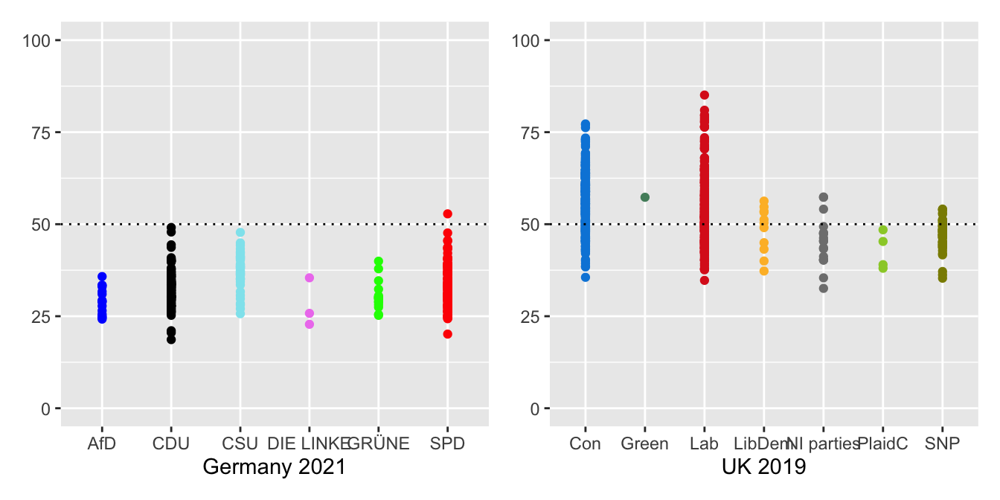

```{r setup7, include=FALSE}
source("_setupAll.R")
library(openintro)
```

# What affects interpretation? {#secInterp}

> "As in most cases when the truth becomes clear you wonder how you could ever have seen things differently."

> `r tufte::quote_footer('--- Ruth Rendell, \'Not in the Flesh\'')`

Interpreting graphics depends on paying attention to the graphics, understanding what is seen, and checking\index{checking} what is seen.\index{Films!The Lady Vanishes}

## Attention {#secAttention}
> "Can you describe her?"

> "It\'s a bit difficult.  She was sort of middle-aged and ordinary."

> "What was she wearing?"

> "Tweeds, oatmeal flecked with brown, a three-quarter coat with patch pockets... a scarf, felt hat, brown shoes, a tussle shirt... and a small blue handkerchief in her
breast pocket. l can\'t remember any more."

> "You couldn\'t have been paying attention."

> `r quote_footer('--- Michael Redgrave questioning Margaret Lockwood in \'The Lady Vanishes\'')`

Graphics texts generally consider perception and interpretation, including optical illusions, but do not pay as much attention to attention.  There is an implicit assumption that viewers who look at a graphic are giving it their full attention.  That seems as unrealistic as assuming that all the students attending a lecture are giving it their undivided attention.

\newpage

```{r bibi1, fig.asp=1, out.width="80%", fig.width=6.5*0.8, fig.cap = 'Scatterplot of Biacromial diameter against pelvic breadth (Biiliac) for 507 adults.'}
data(bdims, package="openintro")
ggplot(bdims, aes(bii_di, bia_di)) + geom_point() + theme(axis.title.y = element_text(angle = 0, vjust = 0.5)) + coord_fixed() + xlab("Biiliac") + ylab("Biacrom")
```

Does Figure \@ref(fig:bibi1)\index{datasets!body} demand attention?  Someone might glance at it and decide the scatterplot did not look interesting.  Perhaps the measurements did not mean anything to them or perhaps they did, but the topic did not attract them.  They might have been distracted by the cup of coffee they had just made, by an email or by a noise in the street.  They might have been tired or bored.  Or, perhaps, they devoted sustained and concentrated attention to Figure \@ref(fig:bibi1).  Graphics are often discussed objectively and yet there are many subjective factors affecting how they are viewed.

Biacromial diameter is a technical term for a measurement of the width between the shoulders and Biiliac may be described as "pelvic breadth".  Knowing that might make someone look at the graphic more closely and think that is is surprising the two measurements are not more correlated. Many body measurements are.  There are a few Biiliac values that appear lower than the rest.  It is curious that the highest pelvic breadth value and two of the three lowest have about the same middling shoulder width.

A graphic without structure can be interesting because it was expected to have structure and did not or because there is more to it when additional information is included.  Figure \@ref(fig:bibi2) colours the points of the plot by sex.

```{r bibi2, fig.asp=1, out.width="80%", fig.width=6.5*0.8, fig.cap = 'Scatterplot of Biacromial diameter (shoulder width) against Biiliac (pelvic breadth) for 247 men (in green) and 260 women (in purple).'}
ggplot(bdims, aes(bii_di, bia_di, colour=factor(sex))) + geom_point() + scale_colour_manual(values=c("purple2", "springgreen3")) + theme(legend.position="none", axis.title.y = element_text(angle = 0, vjust = 0.5)) + coord_fixed() + xlab("Biiliac") + ylab("Biacrom")
```

Generally, women have about the same pelvic breath as men but narrower shoulder widths.  The displays in Figures \@ref(fig:bibi1) and  \@ref(fig:bibi2) use data collected around twenty years ago (@heinz:2003)\index{datasets!body}.  There are not many datasets of multivariate measurements of individuals and in working with this one, the authors' proviso should be remembered that "the sample is not a representative sample from a well-defined population".  The R help file says it was men and women who were primarily in their twenties and thirties and who all exercised several hours a week, hardly typical of the general population.

If information is to be gained from a graphic, it has to be paid some attention.  How much attention is paid and how that attention is paid are important.  A quick scan of a display can suggest the type of graphic and what the overall structure could be.  More focused and concentrated attention may be needed to confirm first impressions, to pick out additional features, and to consider what further information might be useful.  Background knowledge of what the variables mean and of how the data were collected are needed, as is information about the quality of the data.

\newpage

Inspecting a graphic once is rarely sufficient  The source should be checked and any text associated with the graphic reviewed.  Sometimes a graphic can be compared with related graphics, sometimes there are other questions that need to be investigated before returning to the graphic itself.  If a graphic is worth drawing, then it should be worth careful and thorough study.  This involves not just the graphic itself, but also any relevant associated information.

Initial impressions can be deceptive. There may be several features that can be seen in a graphic and rather than fixating on one, it is more effective to consciously look for others. Like brainstorming, it is helpful to generate a number of ideas before being too critical of any of them.  As always, varying the shape and size of the display may help.

Expectations influence what is seen, either negatively or positively. If there are strong expectations of what a graphic will show, viewers may only look for corroborating evidence. On the other hand, if there are no expectations then they may simply accept what they see and lose the capacity to be surprised. It is best to think in advance of what is likely to appear and to look more closely---even if expectations are met.

### Types of attention
Before paying full attention, there is what is referred to as preattentive processing (although attention does play a role, @healey:2012).  People can pick out 2 red dots in a cloud of blue dots without even trying.  They might then use focused attention to concentrate on those points and their neighbourhoods or they might distribute their attention over the whole display looking for other features.

Sometimes something may catch a viewer's eye when they are not looking directly at it, thanks to their peripheral vision.  @potter:2014 concludes that in certain circumstances people can see meaning in a photograph within 13 ms.  Perhaps that ability encourages them to only glance at graphics, and not try to see more in them.  Even if graphics are studied more closely, there is the effect that Barbara Tversky calls the fourth law of cognition (@tversky:2019): The mind can override perception.  She writes: "We don’t always look, even when the answer is right in front of our eyes. Memory overrides perception."  Both effects contribute to explaining why graphics are often poorly interpreted.  The fourth law of cognition may also underlie why some graphics are poorly described by their own authors.  They may be writing about what they wanted to present and not what can be seen in the graphic.

\newpage

What attention is paid to may be goal-driven (top-down), stimulus-driven (bottom-up) or history-based (depending on the viewer's experience).  The goal of drawing the map of German election\index{datasets!Bundestagswahl} results in Figure \@ref(fig:btwMapE), repeated here in Figure \@ref(fig:btwMapEX), was to see if there were geographical patterns.  The main ones for the CDU, CSU, SPD, and AfD stand out (goal-driven).  The smaller constituencies where the Greens did well imply that they did well in urban areas and the fact that Die Linke party are in the legend means they must have won seats somewhere (stimulus-driven).  Political maps give poor representations of party support because they display areas and not populations (history-based).

```{r btwMapEX, fig.cap='Winners of Erststimmen seats by political party in Germany 2021'}
btwMX
```

@theeuwes:2018 claims that stimulus-driven and history-based attention selection are effortless, while goal-driven requires effort.  His research is related to dynamic situations, such as driving, but is still relevant.  It is easier to respond to a strong feature or recognise a familiar pattern than to identify a feature that may or may not be associated with a particular goal.  Having experience of what types of feature a graphic can show is valuable.

\newpage

Studying a graphic display closely may reveal a number of features, yet frequently a later inspection of the same graphic can reveal other features.  It is useful to look at graphics afresh, to break the train of thought.  A graphic you have drawn yourself or is on the web can be varied by changing the size, the aspect ratio or the position on screen.  You can change the colours, the symbols and the scales in your own graphics.  You could zoom out to see where the data lie on some grander scale or you could zoom in to investigate a small sector in detail.  The more complex the plot, the more options there are.  Multivariate displays like parallel coordinate plots and mosaicplots have a particularly large number of alternative options, especially the numbers of possible orderings\index{ordering}.  Different graphics can be used for the same data, e.g., boxplots or density estimates instead of histograms for single continuous variables.  Graphics for related variables in the same dataset can be drawn.  The essential principle is to regard graphics as doorways to information, not as static pictures.

Presentation graphics are sometimes designed to attract attention to make them memorable, sometimes to direct attention to a feature in them.  It is easy to make a display memorable by adding an outlandish touch, overly dramatic colours or exotic background pictures.  Whether the graphic's information is then also memorable is another question.

### Cognitive load\index{cognitive load}
Complex graphics can be difficult to study and understand.  Sometimes graphics in scientific articles are complex and tightly packed with information because space is limited.  Sometimes a complex graphic is just a good summary of complex data, as with Figure \@ref(fig:elecStat2) or Figure \@ref(fig:Palpcp2), shown again in Figure \@ref(fig:Palpcp2X)\index{datasets!Palmer penguins}.

```{r Palpcp2X, fig.asp=0.5, fig.cap = 'Reordered parallel coordinate plot of the Palmer Penguin data'}
PalY
```

Muddled graphics can be difficult to understand for other reasons.  Anything that increases the cognitive load or mental effort required to look at a graphic should be avoided.  Having graphics and accompanying text on different pages demands extra effort.  Poor labelling and awkward scales make work.  A poorly ordered and positioned legend does not help.  Overlapping text and confusing colours need to be disentangled.  Data points that are too close to axes or borders can be difficult to distinguish.  Comparisons are made more difficult if scales that should be the same are not or if graphics to be compared are not aligned as they should be.

\newpage

### Rewards for paying attention
Paying close attention to graphics can reveal much more information.  The Gapminder\index{datasets!Gapminder} life expectancy graphic of Figure \@ref(fig:LEyr) and Figure \@ref(fig:movieVR) for movie ratings\index{datasets!movies}, both shown again in Figure \@ref(fig:gapMovie), are striking examples.  Figure \@ref(fig:candvs2) for the 1912 Democratic choice of candidate is another.

```{r gapMovie, fig.asp=0.4, fig.cap='Gapminder life expectancy data (left) and movie ratings (right)'}
pgmX + vr
```

Accepting the title of a graphic or what other accompanying text says may not tell the full story.  It is worth paying graphics detailed attention.  However, relying on graphics alone will not be sufficient.  Graphics have a background and context and need to be understood within that framework.  A closer look at the data underlying a graphic is warranted too.

## Understanding {#secUnderstand}

> "The more I practise, the luckier I get."

> `r tufte::quote_footer('--- the golfer Gary Player')`

### Knowledge
Knowledge of what graphic forms represent is necessary to understand what information features might convey.  Individual graphics have a general structure with local details that suggest additional information.  Combined with other graphics they provide an overall picture of the data whose interpretation will depend on the context and background.  Familiarity with what features may arise, and why, makes it easier to understand what is being shown by the graphics for a new dataset.

Some of the graphics literature is concerned with new, innovative graphics, emphasising novelty over familiarity.  The advantage is the novelty itself, the attraction to viewers of something unknown, possibly striking.  The disadvantage is viewers' lack of experience with the form.  While new developments are welcome, viewers will see more with graphics they are familiar with.

Background knowledge is also indispensable, whether your own or that of collaborating domain experts.  With data by country over time it was necessary to know how countries have changed (e.g., Chapters \@ref(secGapm), \@ref(secChess), Chapters \@ref(secOlymps), and \@ref(secEuros)).   With swimming, information on the rules for different strokes, on full body swimsuits, and on the introduction of the butterfly was valuable (Chapter \@ref(secSwim)).  Another swimming\index{datasets!swimming times} example, Figure \@ref(fig:relay400), repeated here as Figure \@ref(fig:relay400X), concerned the reasons why the best 200 times for individuals and relay teams were so different.

```{r relay400X, out.height="50%", fig.height=6.5*0.5, fig.cap = 'Best times for the 400 m freestyle events for men and women, individual (red) and relay (blue)'}
ir400
```

Much can be found out about the Olympics on the web, such as stories surrounding particular events, how times were measured, when rules were changed (Chapter \@ref(secOlymps)), but you have to look.    The web is not always helpful.  Going back to original documentation can be, as with the articles by Michelson and Newcomb on their attempts to measure the speed of light (Chapter \@ref(secLightS)), and with getting the full survey from Annenberg that included the gay rights questions (Chapter \@ref(secGayR)).  Often dataset owners/maintainers are very helpful as happened with Chapters \@ref(secVehicles) and \@ref(secComM).
 
### Experience
What do people pay attention to when they visit a famous building?  Architects will study the building.  Historians may study the symbolism, and locals will have their own ideas about what stands out.   What can be seen happening during a sporting event?  Coaches will view it differently than fans, and with team games, different sets of fans will see the same game very differently (@hastorf:1954).  In these situations it comes down to motives, interest and background knowledge, education, and experience.  The same goes for looking at graphics.  Motives may vary between viewers, interest and background knowledge can hopefully be assumed, but education and experience can not.  It is helpful to study how to look at graphics and to look at a lot of graphics to learn how to recognise what might be seen in them.  Just looking is not enough.  Or as Spear put it: "there is quite a difference between simply looking at a chart and seeing it." (@spear:1969).

And what should be looked at in a graphic?  If researchers have no experience, it is hard for them to know what to look for.  De Groot showed that international master chess players chose better moves than club players because they recognised the structure of positions (@deGroot:1978, a second edition in English of his Dutch thesis from 1946).  The same doubtless applies to viewers studying graphics.  If they are familiar with data graphics and understanding and interpreting them, they will find it easier to understand and interpret graphics from a new dataset.

\newpage

The peaks in the finishing times for the Comrades marathon\index{datasets!Comrades Marathon} in Figure \@ref(fig:comTimes), drawn again in Figure \@ref(fig:comTimesX), are an example.  Others have seen similar patterns in other marathon races (@marastats:2019).

```{r comTimesX, out.width="70%", fig.width=6.5*0.7, fig.cap = 'Finishing times in the 2019 race for females (above) and males (below), dotted lines mark limits for awarding medals other than gold'}
cmvf/cmvm
```


### Possible cognitive biases
Even if you pay proper attention there may be influences hindering your making proper use of what you see.  Examples of forms of cognitive bias include

* Confirmation bias: look for information supporting prior beliefs   
* Hindsight bias: past events seem more likely than they were  
* Recency bias: recent events are more important  than historic ones   
* Anchoring bias: overemphasise the effect of some reference point.  It can mean anchoring any thoughts about a graphic to what is seen first.  It is always sensible to look at the data in different ways, developing alternative perspectives.  
* Availability bias: rely too much on examples to hand.  Data are available on the web for Olympic results\index{datasets!Olympic Games} that were missing in Figure \@ref(fig:olyAmd), shown again here as Figure \@ref(fig:olyAmdX), but discussing the problems is more instructive (and less effort) than solving them in this case.  

```{r olyAmdX, fig.asp=0.7, out.width="70%", fig.width=6.5*0.7, fig.cap = 'Athletics field events for men: percentage differences in gold medal performances compared with averages over the last six Games'}
AmdX
```

* Representativeness bias: use particular examples without taking account of sample size and base rates.  Avoid by using spineplots for comparing rates (e.g., in Figure \@ref(fig:gayGR)) and UpAndDown plots for comparing changes\index{datasets!Bundestagswahl}, as in Figure \@ref(fig:btw3), drawn again in Figure \@ref(fig:btw23X).  

```{r btw23X, out.width="70%", fig.width=6.5*0.7, fig.asp=0.5, fig.cap = 'An UpAndDown plot showing absolute changes in party support between the last two German elections as area and relative changes as height'}
y2b$uad + guides(fill = guide_legend(nrow = 1))
```

* Perceptual bias: we see what we want to see 

## Checking {#secCheck}
> "Aristotle maintained that women have fewer teeth than men; although he was twice married, it never occurred to him to verify this statement by examining his wives' mouths."

 > `r tufte::quote_footer('--- Bertrand Russell, The Impact of Science on Society')`

Published graphics may appear polished, attractive, and convincing\index{checking|(}. Photographs prepared by estate agents for houses they are selling may also be described that way. Many graphics were drawn first and discarded just as many more photographs were taken than are used.  Scepticism and thorough checking are called for.  Popper's\index{people!Popper@Karl Popper} concept of falsification\index{falsification} suggests that it is better to search for evidence to refute your impressions than to look for supporting evidence.  As xkcd has pointed out (@xkcd:2012), with enough options you have a good chance of finding something that looks significant that is not.  Checking develops your own trust in your conclusions and should help to convince others.   There are several independent ways of checking features detected in graphics.

### Provenance\index{provenance}
Are the data from a reliable source?  Is it known how they were collected, edited, and summarised?  Are they precise measurements or uncertain estimates?  Do the variables mean what you think they do or have they been defined or collected differently?  All this and more is discussed in Chapter \@ref(secProvQ).

### Looking at the numbers
Do the scales\index{scaling} look sensible? Perhaps the minima or maxima look too extreme (Figure \@ref(fig:LE2) (left) or Figure \@ref(fig:movieRunB)). Do the data appear to be complete? Perhaps there are gaps in the data (Figures \@ref(fig:movieTT2), \@ref(fig:olyAmd) or \@ref(fig:histPrice)) or missing categories (Figures \@ref(fig:olyEg) to \@ref(fig:olyEgS)). Categories that are missing altogether can be difficult to spot. Political opinion polls show party support, but not always how many who were asked did not respond.  Maybe the data just look wrong, as in Figure \@ref(fig:difs) for differences in spaceflight mission times\index{datasets!astronauts}.

Sometimes there is heaping at particular values, usually due to rounding (Figure \@ref(fig:movieRunH)), sometimes particular values are never recorded (Figure \@ref(fig:histPrice)). Sometimes all the data have been rounded, so that a continuous measurement appears to be discrete.  If you ask people what their height is they will report a rounded, possibly inaccurate number.  Better data would be obtained by measuring heights in a uniform way under identical conditions for all (@student:1931).

### Varying plots
Graphics redrawn in different ways leave different impressions, emphasising different information.  Size, aspect ratio, and position can strongly influence what can be seen. Graphics can be resized, moved, and zoomed in or out.  Plot options can be changed: maxima and minima of scales, origin location, histogram binwidths, point sizes, colours, ....  Whether some variations are better than others is neither here nor there: the important principle is to check several.  Figure \@ref(fig:gaySCCS) shows an example for the gay rights data.  Figure \@ref(fig:movHists) displays a default histogram for the movie runtimes\index{datasets!movies} and the one used in the chapter, Figure \@ref(fig:movieRunH), including only films of 3 hours or under and using a binwidth of 1 minute.  Far more graphics were drawn for each case study than are included in the book.

```{r movHists, fig.asp=0.4, fig.cap = 'Histograms of movie runtimes, the default on the left and a varied one on the right (note the different scales)'}
f22x <- ggplot(films22, aes(runtime)) + geom_histogram() + ylab(NULL) + xlab(NULL)
f22x + f22s
```

### Varying plot forms
Drawing different kinds of plots of the same variable(s) provides new insights: a boxplot\index{boxplot} or density estimate\index{density estimate} instead of a histogram\index{histogram} (Figures \@ref(fig:histnewcX) to \@ref(fig:densnewcX) or Figures \@ref(fig:histElo) and \@ref(fig:boxElo)), scatterplots\index{scatterplot} by group (faceting\index{faceting}) instead of a single scatterplot (Figures \@ref(fig:LEr4) and \@ref(fig:LEf4)), a doubledecker plot\index{doubledecker plot} instead of stacked barcharts (Figure \@ref(fig:gayGR)).

### Statistical checks
Statistical models and graphics complement and augment one another, although it is an unbalanced relationship. There are almost always graphical ways of visually assessing the results of statistical models, but there are not always statistical models that can evaluate ideas derived from graphics. If there are, they should be used. If it looks as if there is a nonlinear relationship between two variables in a scatterplot, then a spline model could be fit.  This was used for modelling trend in Figure \@ref(fig:AgeRatingSmooth) for ratings of Chess players\index{datasets!chess ratings} and Figure \@ref(fig:socDf) for proportions of draws in different football leagues\index{datasets!league football}.  Both are drawn here again in Figure \@ref(fig:ChessSocSm).

```{r ChessSocSm, out.width="45%", fig.asp=0.6, fig.show="hold", fig.cap = 'Smooths of chess ratings (left) and football league draws (right)'}
ags1520
drEIS
```

If a spineplot suggests two categorical variables are not independent, a chi-squared test could be used.  More complicated data, such as the survival rates on the Titanic\index{datasets!Titanic} in Figure \@ref(fig:titanBoth), could be examined using logistic regression.

Examples where statistical models are not so readily available include assessing possible outliers in a scatterplot and whether there are multiple modes in a histogram.

### Checking consequences
-   Internal checking  
Are patterns across the whole dataset also found in subgroups?  The surprising peak in the chess ratings\index{datasets!chess ratings} at 2000 shown in Figure \@ref(fig:histElo) was explained by comparing ratings for active and inactive players in Figure \@ref(fig:hist2Elo), shown here again as Figure \@ref(fig:histEloX).  

```{r histEloX, fig.asp=0.3, fig.cap = 'Ratings of active and inactive chess players in 2020'}
actInact
```

The decline in survival rate across the Titanic's three passenger classes applied to women, but not to men (Figures \@ref(fig:titanCrew) and  \@ref(fig:titanPass)). Conclusions might have implications for other variables and it is useful to see if patterns are consistent across a dataset.

-   External checking  
If relevant data can be found, compare results with other related datasets (§\@ref(sec1912Dem2), §\@ref(secChess4) or Figure \@ref(fig:btwDotV), drawn again here as Figure \@ref(fig:btwDotVX))\index{datasets!Bundestagswahl}.

```{r btwDotVX, out.width="90%", fig.align = 'center', fig.cap='Seat-winning percentages by party in Germany 2021 and in the UK 2019'}

```

### Context
Results have to make sense and be interpreted in context. A pattern of points in a scatterplot will be judged in different ways for different datasets or different variables (Figure \@ref(fig:s100mScat)). Errors like negative heights or zero dimensions (Figure \@ref(fig:histLen)) are obvious. Weekly patterns in sightings by birdwatchers or in disease reporting may need to be checked. More birdwatchers may be out and about at weekends and reporting of diseases may be influenced by media attention.  Differences in mortality rates between countries or over time may be due to definitions, conditions or treatments as Covid pandemic statistics have illustrated.

In comparing opinions on same-sex marriage from Figure \@ref(fig:gayB), redrawn here as Figure \@ref(fig:gayBX), it is well to remember that the questions were about different situations, that they were framed differently, and that only a third of the sample were asked the state question.

```{r gayBX, fig.asp=0.4, fig.cap = 'Line plots of support for same-sex marriage at federal level (left) and opposition to a Constitutional Amendment (right) by age of respondent by males (green) and females (purple)'}
state1 + fed1
```

### Discussing with others, especially domain experts
What one person sees when they look at a graphic may not be what another person sees. Combining opinions is more effective than relying on one person's views---provided that the opinions are independent.  Graphics analysts will not have the subject knowledge of experts in the field and they should be consulted.  Amongst other topics expertise was sought on chess ratings (Chapter \@ref(secChess)), ornithology (Chapters \@ref(secFinches), \@ref(secPalmerPen), and \@ref(secShears)),  swimming (Chapter \@ref(secSwim)), and German elections (Chapter \@ref(secBTwahl)).  The role of Ausgleichsmandate\index{Ausgleichsmandate} in making the German parliament much larger than intended was important information gained.  This was shown in Figure \@ref(fig:ubH), repeated in Figure \@ref(fig:ubHX)\index{datasets!Bundestagswahl}.

```{r ubHX, fig.asp=0.5, out.width="75%",  fig.width=6.5*0.75, fig.cap = 'Extra seats in German elections since 1949.  Each point marks the date of an election.  The left dashed line marks the first election after reunification in October 1990.  The right dashed line marks the first election with Ausgleichsmandate.'}
ueP
```

### Replicate
All of the checks listed so far can be carried out relatively quickly.  The ideal would be to attempt to independently replicate results.  Replication should be possible for scientific studies by having different researchers carry out fresh studies in different environments.  This may be impractical for reasons of time, organisation, and finance, but is the ideal to aim for.  Examples include estimating the speed of light (Chapter \@ref(secLightS)), evaluating treatment of psoriasis (Chapter \@ref(secPsor)), and distinguishing shearwaters (Chapter \@ref(secShears)).

If datasets are large, a partial replication can be achieved by splitting the dataset into independent groups by sampling.  This was suggested in connection with fitting a smooth to the chess ratings data in Figure \@ref(fig:ratAge15s).

Some datasets are regularly updated, e.g., movies (Chapter \@ref(secMovies)), fuel efficiency (Chapter \@ref(secVehicles)), and elections (Chapter \@ref(secBTwahl)).  Results can then be checked for consistency over time.

### Example of checking
The best times for swimming events\index{datasets!swimming times} were studied in Chapter \@ref(secSwim).  The form observed in the first plot for the 100 m freestyle for men, Figure \@ref(fig:swM100f), was checked by looking at other strokes and other distances.  The possibility of an overlap in times between female butterfly and freestyle swimmers in Figure \@ref(fig:swM50amf) was checked by drawing a different display, multiple boxplots, in Figure \@ref(fig:sw50af).  This display was also drawn horizontally rather than vertically, to make better use of space and to provide an alternative point of view.\index{boxplot}  The data behind the outlier in Figure \@ref(fig:sw200amf) was checked and a classification error was uncovered: it was a time for that swimmer at that competition, but in a different event.

\newpage

The displays for 50 m races and 200 m for men and women, Figures \@ref(fig:swM50amf) and \@ref(fig:sw200amf), were different in one important respect: the backstroke swimmers caught up on the butterfly swimmers.  Checking with swimming experts revealed the reason, the different rules on turning between lengths for the events.  The figures are shown again in Figure \@ref(fig:swim50200X).  Note the different vertical scales of the left and right plots.\index{checking|)}

```{r swim50200X, fig.asp=0.8, fig.cap = 'Best times in seconds for the four 50 m (left) and four 200 m (right) swimming events achieved by men and women in the order breaststroke, backstroke, butterfly, freestyle from the top'}
sw50yX + sw200yX
```

### Main points {-}
* Attention varies depending on goals and conditions.  Excessive cognitive load should be avoided.
* Successful understanding depends on knowledge, experience, and avoiding biases.
* There are many ways to check ideas and all should be used.
